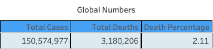
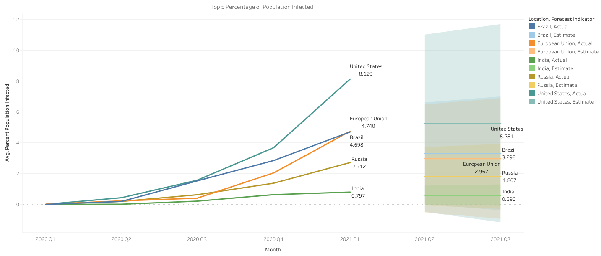

# 🌐 Unveiling Insights: A COVID-19 Data Tale with SQL Exploration and Tableau Viz
 
## Overview

This repository contains SQL queries and Tableau visualizations exploring COVID-19 data. The project aims to uncover insights into the pandemic's impact using data analysis and visualization.

## SQL Data Exploration

- **Global Insights Snapshot:**
  - Query to capture total cases, deaths, and death percentage globally.

- **Continent Chronicles:**
  - Query showcasing death counts across continents.

- **Mapping the Pandemic:**
  - Query revealing infected populations in diverse countries.

- **Time Series Marvel:**
  - Query predicting the trajectory of infections with a time series line chart.

## Tableau Project Overview

Embark on a visual journey through the narratives uncovered in our COVID-19 data exploration. The Tableau visualizations enhance the understanding of the pandemic's impact, presenting insights in a captivating and interactive way.

### Visualizations

1. **Global Insights Snapshot:**
   Explore the total cases, deaths, and death percentage, capturing the heartbeat of the pandemic on a global stage.
   
 
2. **Continent Chronicles:**
   Witness death counts across continents in a dynamic pie chart, where Europe, North America, and South America steal the spotlight.
   

3. **Mapping the Pandemic:**
   Explore a captivating map revealing the virus's journey, vividly showcasing infected populations in diverse countries.
   

4. **Time Series Marvel:**
   Dive into a captivating time series with a line chart featuring the top 5 countries, predicting the trajectory of infections.
   
 ## How to Interact

To interact with the Tableau visualizations:
- Click on the links above to view individual visualizations.
- For an immersive experience, visit the [Tableau Public Dashboard](link-to-your-tableau-dashboard) for the complete project.

Feel free to explore, analyze, and share your insights!

---

**Note:** Replace `link-to-your-tableau-dashboard` with the actual link to your Tableau Public Dashboard or the hosted version of your project.

