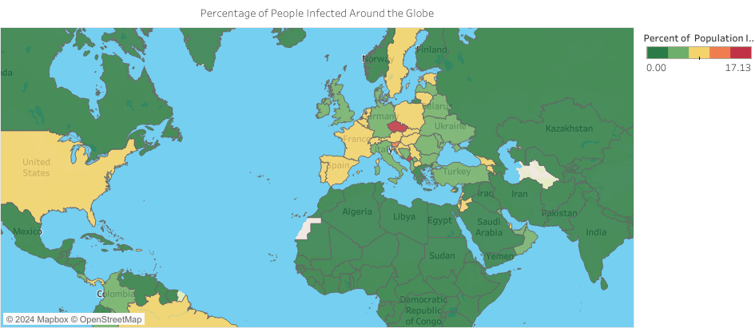

# 🌐 Unveiling Insights: A COVID-19 Data Tale with SQL Exploration and Tableau Viz
 
## Overview

This repository contains SQL queries and Tableau visualizations exploring COVID-19 data. The project aims to uncover insights into the pandemic's impact using data analysis and visualization.
## SQL Data Exploration Project

The (SQL_COVID_19datalorationproject.sqexpl) file contains a series of SQL queries designed to explore and analyze COVID-19 data. Each query addresses specific questions, providing insights into various aspects of the pandemic. Below is a brief overview of the queries included in the file:

1. **Q1: Total Cases vs Total Deaths**
   - Analyzes the likelihood of death if contracting COVID-19 in different countries.

2. **Q2: Total Cases vs Population**
   - Explores the percentage of the population infected with COVID-19.

3. **Q3: Death Percentage in All Countries**
   - Displays the death percentage in all countries.

4. **Q4: Countries with Highest Infection Rate compared to Population**
   - Identifies countries with the highest infection rate relative to their population.

5. **Q5: Countries with Highest Death Count per Population**
   - Highlights countries with the highest death count per population.

6. **Q6: Breaking Things Down by Continent**
   - Shows continents with the highest death count per population.

7. **Q7: Global Numbers**
   - Provides an overview of global cases, deaths, and the percentage of deaths.

8. **Q8: Total Population vs Vaccinations**
   - Shows the count of the population that has received at least one COVID vaccine.

9. **Q9: Using CTE to Perform Calculation on Partition By in Previous Query**
   - [Provide a brief description here.]

## Tableau Project Overview

Embark on a visual journey through the narratives uncovered in our COVID-19 data exploration. The Tableau visualizations enhance the understanding of the pandemic's impact, presenting insights in a captivating and interactive way.

### Visualizations

1. **Global Insights Snapshot:**
   Explore the total cases, deaths, and death percentage, capturing the heartbeat of the pandemic on a global stage.
   
 
2. **Continent Chronicles:**
   Witness death counts across continents in a dynamic pie chart, where Europe, North America, and South America steal the spotlight.
   

3. **Mapping the Pandemic:**
   Explore a captivating map revealing the virus's journey, vividly showcasing infected populations in diverse countries.
   

4. **Time Series Marvel:**
   Dive into a captivating time series with a line chart featuring the top 5 countries, predicting the trajectory of infections.
   
 ## How to Interact

To interact with the Tableau visualizations:
- Click on the links above to view individual visualizations.
- For an immersive experience, visit the [Tableau Public Dashboard](https://public.tableau.com/views/Covid19analysisdashboard_17005730628510/covid19dashboard?:language=en-US&:display_count=n&:origin=viz_share_link) for the complete project.

Feel free to explore, analyze, and share your insights!

---

